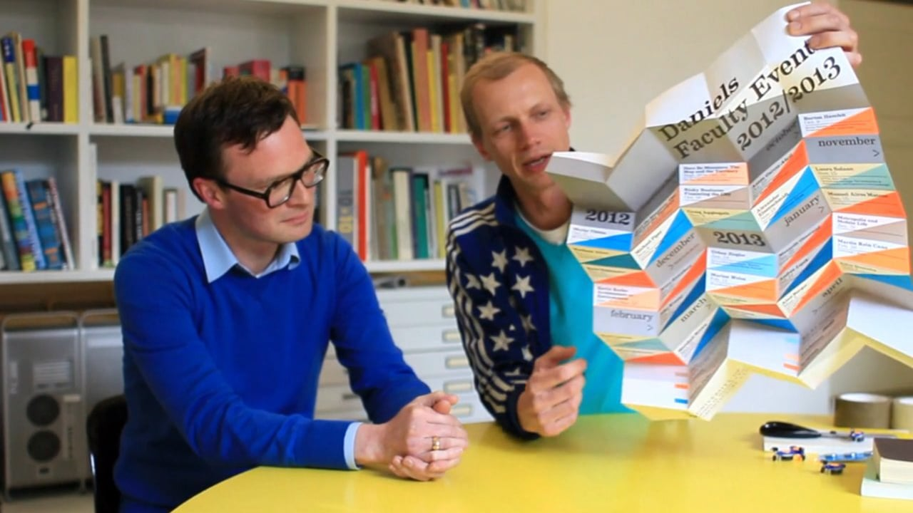

## Catalogtree ##

## Backgound ##

- Multidisciplinary design studio based in Arnhem (NL) and Berlin (DE)
- Founded in 2001 by Daniel Gross and Joris Maltha who met at [Werkplaats Typografie](https://www.werkplaatstypografie.org/). - Nina Bender joined the studio in 2011.
- Works continuously on commissioned and self initiated projects.
- Highly interested in self-organising systems they believe in 'Form Equals Behaviour'.
- Experimental tool-making, programming, typography and the visualization of quantitative data.
