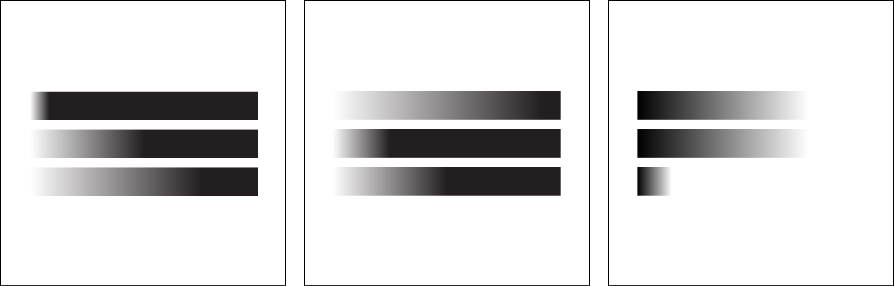

#### Sketch

The round shape with gradient shows 24 hours in one day. The transition of black-to-white and white-to-black will help users to distinguish day time and night time. The inspiriation comes from natural sunlight and round shape represents sky in the traditional Chinese culture.

Retinal Variables: size, value

#### Revised Design

In the revised design, I used one of retinal vatiables (grey) value to represent the differences between hour, minute, and second. Meanwhile, the size of each circle shows the current progress of time.
