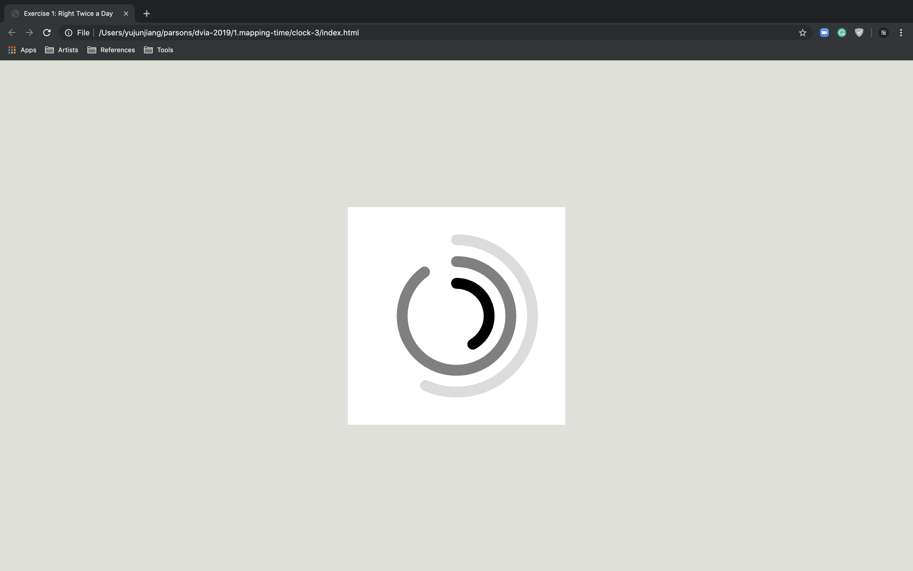

#### Sketch

The concentric circles are the visual presention of time. Each circle's rotation speed conveys the relationship between hour, minute, and second. The color choice was inspired by the natual light.

Retinal Variables: size, value, orientation

#### Revised Design

In the revised design, I used one of retinal vatiables (grey) value to represent the differences between hour, minute, and second. Also, the shape of each arc shows the current progress of time instead of the orientation of gap.
