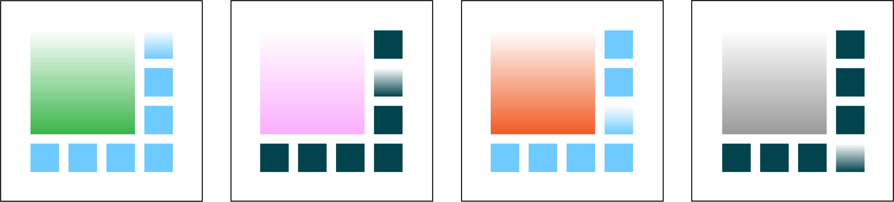
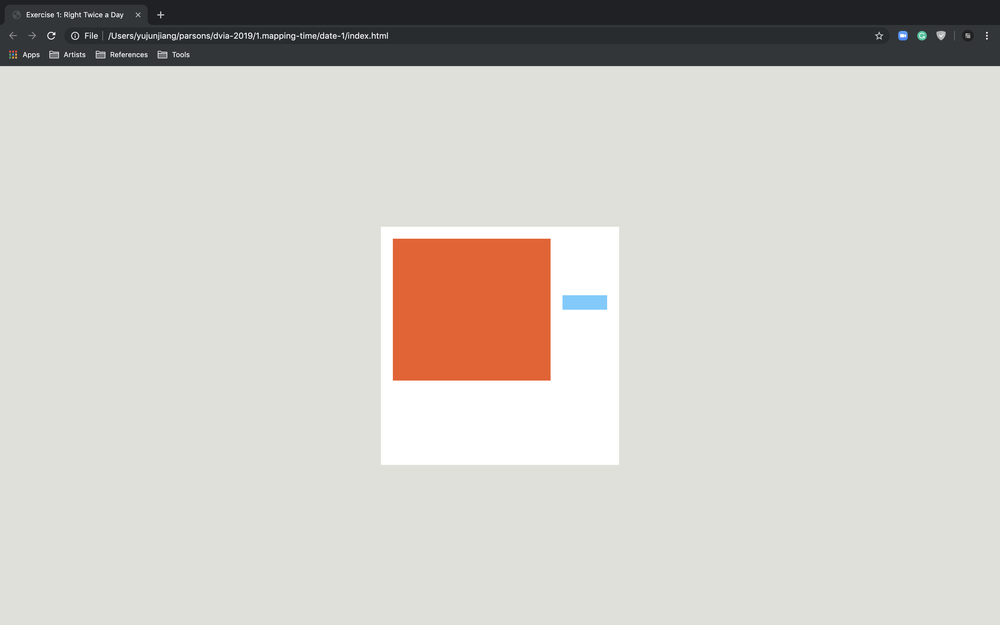
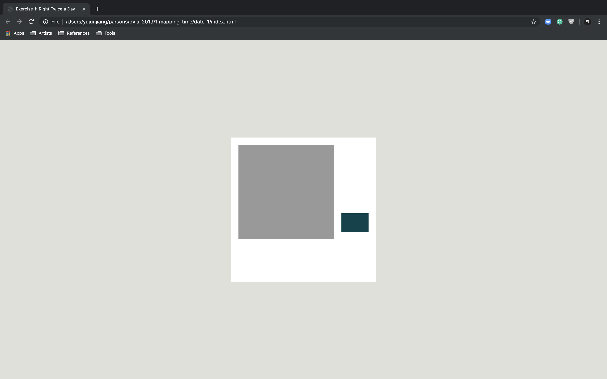

#### Sketch

The big rectangle in the top-left corner represents four seasons by diffetent color in one year. The rest of seven small isometrical rectangle calculates week day and weekend as a loop. Meanwhile, the color in each small rectangle devides daytime and nighttime in two colors.

Retinal Variables: size, value, hue

#### Revised Design

In the revised design, I used different hues in the big rectangle to convey four seasons. The small rectangles are matched with each day in one week as a cycle. Each day has been devided into a.m. and p.m. by two colors

