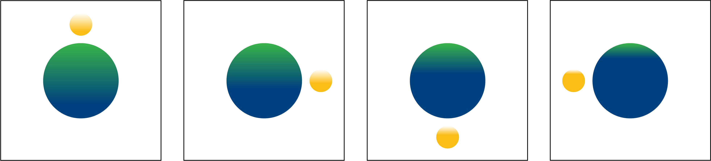
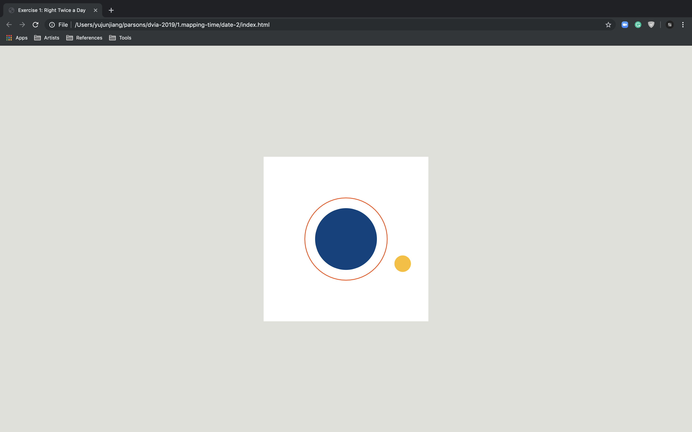
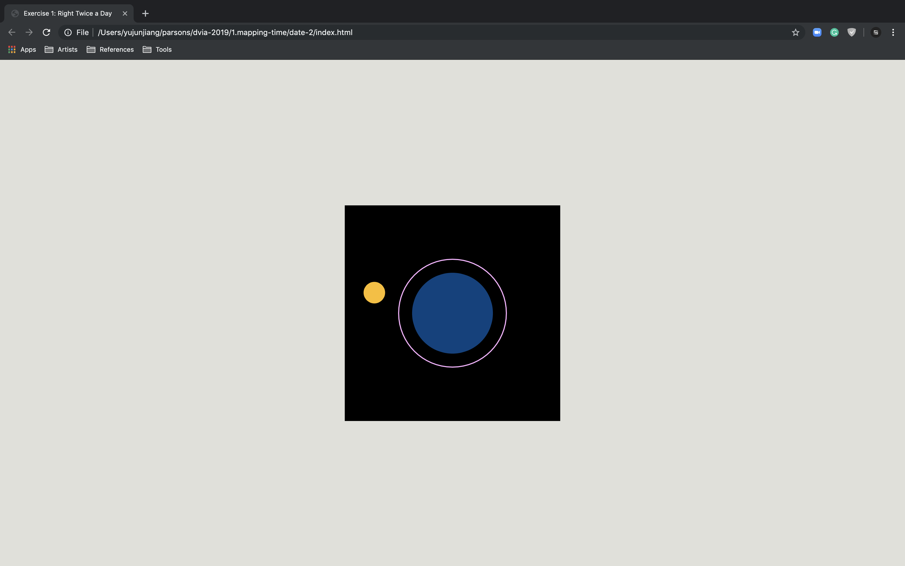

#### Sketch

Two circles are the visual presentation of Earth and the Moon. The Moon is in [synchronous rotation](https://en.wikipedia.org/wiki/Tidal_locking) as it [orbits](https://en.wikipedia.org/wiki/Orbit_of_the_Moon) Earth; it rotates about its axis in about the same time it takes to orbit Earth. The color of Earth conveys the change of four seasons. The ratio of two colors on the Moon tracks lunar phase in the whole year.

Retinal Variables: position, size, value, hue, orientation

#### Revised Design

In the revised design, I used different hues in the big rectangle to convey four seasons. The small rectangles are matched with each day in one week as a cycle. Each day has been devided into a.m. and p.m. by two colors.

