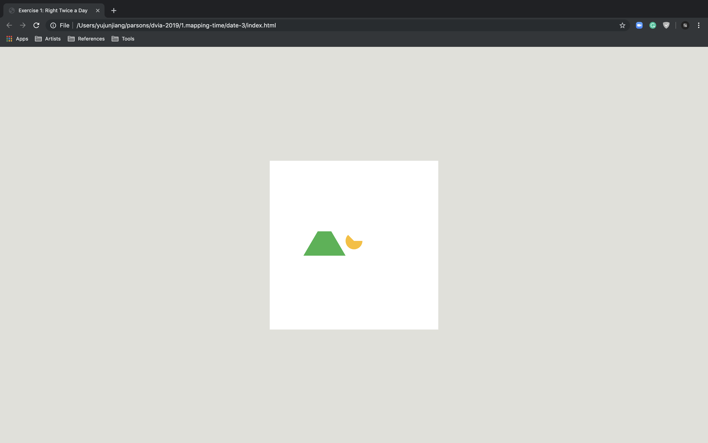
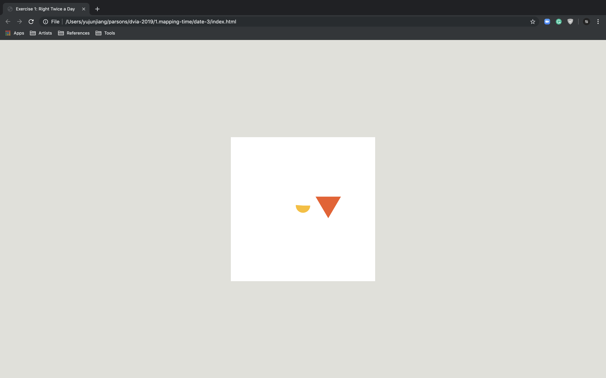

#### Sketch

Two circles are the visual presentation of Earth and the Moon. The Moon is in [synchronous rotation](https://en.wikipedia.org/wiki/Tidal_locking) as it [orbits](https://en.wikipedia.org/wiki/Orbit_of_the_Moon) Earth; it rotates about its axis in about the same time it takes to orbit Earth. The color of Earth conveys the change of four seasons. The ratio of two colors on the Moon tracks lunar phase in the whole year.

Retinal Variables: position, size, value, hue, orientation

#### Revised Design

In the revised design, I used both size and hue to represent Earth and Moon. The background color devided daytime and nighttime in two colors. The orientation of Moon matched with lunar phase in each month. Also, the orbit's colors visualized four seasons by hues.

