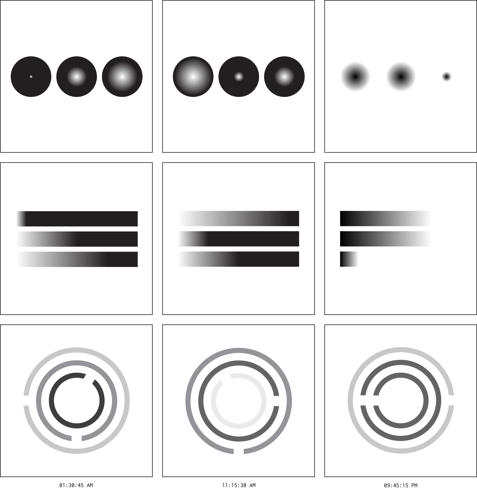
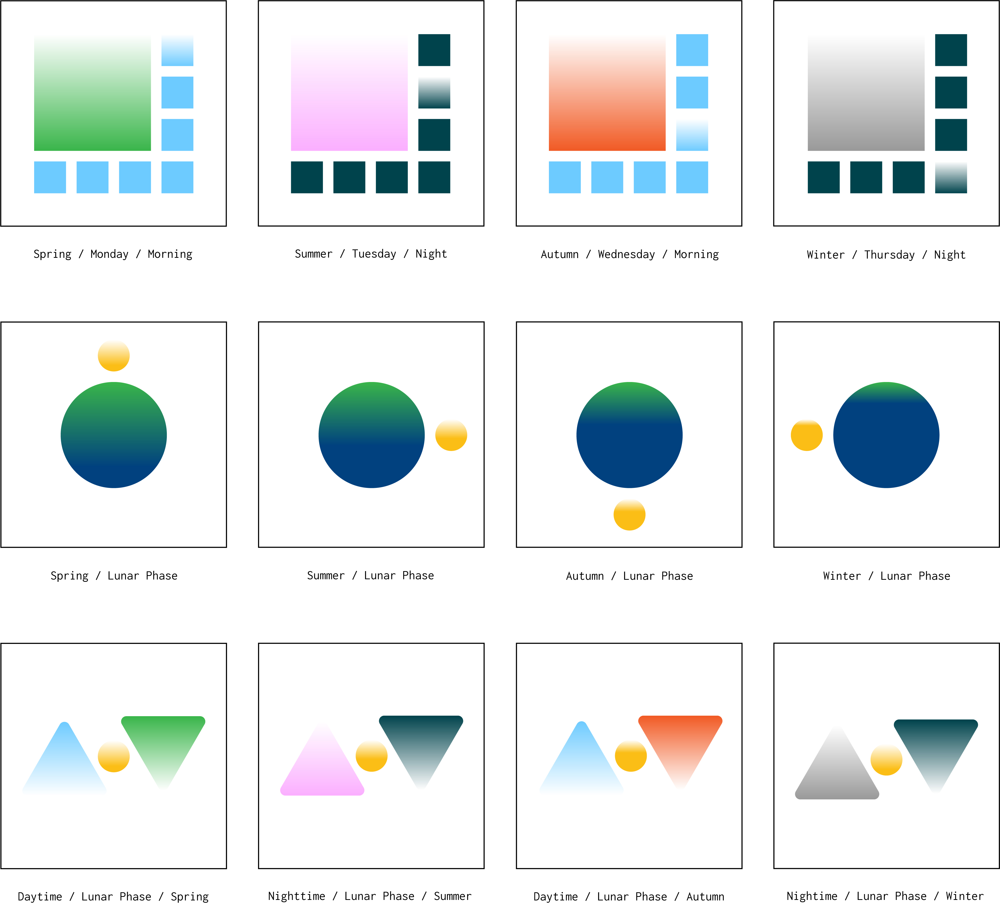

## Weekly Assignment 02

#### Sketch 01
Round shape with gradient shows 24 hours in one day. The transition of black-to-white and white-to-black will help users to distinguish day time and night time. The inspiriation comes from natural sunlight and round shape represents sky in the traditional Chinese culture.

Retinal Variables: size, value
#### Sketch 02
Three bars represent hour, minute, and second in the horizontal direction. The percemtage of black and white colors translate 24 hours into visual language. The horizontal gradient is an expression of sunrise and sunset in the nature.

Retinal Variables: position, size, value
#### Sketch 03
The concentric circles are the visual presention of time. Each circle's rotation speed conveys the relationship between hour, minute, and second. The color choice was inspired by the natual light.

Retinal Variables: size, value, orientation
## Weekly Assignment 03

#### Sketch 01
The big rectangle in the top-left corner represents four seasons by diffetent color in one year. The rest of seven small isometrical rectangle calculates week day and weekend as a loop. Meanwhile, the color in each small rectangle devides daytime and nighttime in two colors.

Retinal Variables: size, value, hue
#### Sketch 02
Three bars represent hour, minute, and second in the horizontal direction. The percemtage of black and white colors translate 24 hours into visual language. The horizontal gradient is an expression of sunrise and sunset in the nature.

Retinal Variables: position, size, value, hue, orientation
#### Sketch 03
The concentric circles are the visual presention of time. Each circle's rotation speed conveys the relationship between hour, minute, and second. The color choice was inspired by the natual light.

Retinal Variables: value, hue, orientation
